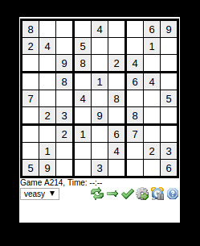

## MMM-Sudoku

Play Sudoku on your mirror. For those that use a keyboard and a mouse.

## Examples

## Installation

* `git clone https://github.com/mykle1/MMM-Sudoku` into the `~/MagicMirror/modules` directory.

## Config.js entry and options

    {
            disabled: f,
            module: 'MMM-Sudoku',
            position: 'top_left',
        },
